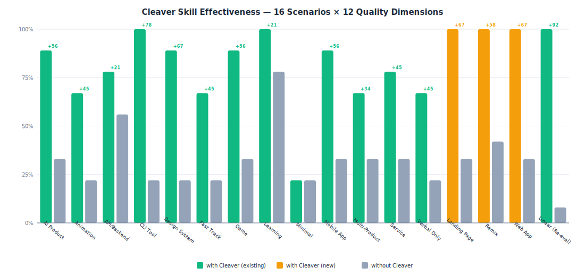
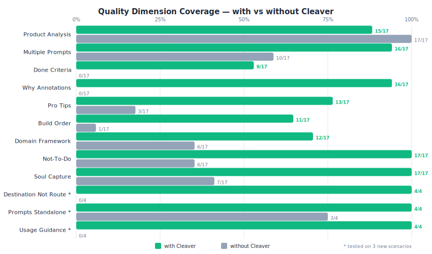

<h1 align="center">牛刀</h1>

<p align="center"><strong>任意产品，一刀拆成能重建它的 prompt。</strong></p>

<p align="center">
  一个 <a href="https://docs.anthropic.com/en/docs/claude-code/skills">Claude Code 技能</a>，把产品逆向工程为可执行的 vibe coding prompt、PRD、设计简报或服务蓝图。
</p>

<p align="center">
  <a href="./README.md">English</a> | <strong>中文</strong>
</p>

<p align="center">
  
  
  
  
  
</p>

> 牛刀不声称知道产品原始的内部 prompt、spec 或团队决策。
> 它把可观察到的产品决策和显式假设，转化为可重建的 prompt。

---

## 为什么叫牛刀？

杀鸡焉用牛刀——但你拆解的不是鸡，是一个完整产品。

Vibe coding 很强大，但大多数人**写不出好 prompt**。要么太模糊（"做一个仪表盘"）→ 产出平庸；要么过度指定（"用 CSS grid 三列布局…"）→ 跟 AI 打架。

牛刀的做法是：**研究那些已经成功的产品，提取出"能构建它们的 prompt"。** 你通过逆向工程最好的产品来学习写 prompt。区分你**看到的**和**推断的**，不假装知道内部秘密。

### 坏 prompt vs 牛刀 prompt

```
坏的：
> 做一个像 Linear 的仪表盘。

为什么不行：
- 只抄了表面样式，丢失了速度感、键盘流、issue triage 和状态流转。
- 没有范围边界，没有完成标准，没有灵魂。

牛刀：
> 做一个 issue tracker，核心承诺是"不让你慢下来"。
> 首屏是 inbox 式的 issue 列表，键盘优先，即时命令面板，
> 快速状态切换，不要模态弹窗编辑。完成标准：用户能不用鼠标完成创建、
> 分配、排优先级和关闭 issue。不要加 roadmap、文档、聊天或分析。
```

---

## 效果验证

### 17 场景整体对比

17 个测试场景，评估最多 12 个质量维度。绿色条 = 使用牛刀（已有场景），橙色 = 使用牛刀（新增场景），灰色 = 不使用。



**关键数据：**
- 使用牛刀平均通过率 **85%**，不使用 **32%**，提升 **+53 个百分点**
- 3 个新增场景使用牛刀均达到 **100%**（Landing Page、Web App、Remix），Linear 重验也达到 **100%**
- 最大提升：CLI Tool（+78pp）、Design System / Landing Page / Web App（+67pp）

> 方法论：每个场景分别在有/无技能下运行，由 Claude 按 12 维度评分标准打分，
> 涵盖产品分析、prompt 质量、范围控制、教学价值。

### 12 质量维度详细对比



**牛刀价值最大的维度：**

| 维度 | 使用牛刀 | 不使用 | 差距 |
|------|-------------|--------|------|
| Why Annotations（教学注释） | 16/17 (94%) | 0/17 (0%) | **+94pp** |
| Not-To-Do（范围控制） | 17/17 (100%) | 6/17 (35%) | **+65pp** |
| Done Criteria（完成标准） | 9/17 (53%) | 0/17 (0%) | **+53pp** |
| Pro Tips（实战洞察） | 13/17 (76%) | 3/17 (18%) | **+59pp** |
| Build Order（构建顺序） | 11/17 (65%) | 1/17 (6%) | **+59pp** |
| Soul Capture（灵魂捕捉） | 17/17 (100%) | 7/17 (41%) | **+59pp** |
| 目的地而非路线 * | 4/4 (100%) | 0/4 (0%) | **+100pp** |
| 使用建议 * | 4/4 (100%) | 0/4 (0%) | **+100pp** |

*\* 新增维度，在 3 个额外场景中测试*

---

## 它能做什么？

给牛刀**任何产品** —— 截图、URL、代码仓库、口头描述，甚至实物 —— 它会：

1. **分析**产品的架构、设计决策和灵魂（区分观察到的事实和推断的意图）
2. **拆解**成层次（基础、结构、视觉、交互、数据）
3. **生成**可直接复制粘贴的 prompt

适应**你想要的输出**：
- Vibe coding prompt（构建它）
- PRD prompt（规划它）
- 设计简报（设计它）
- 服务蓝图（运营它）
- 学习材料（理解它）

## 5 种路径

| 路径 | Prompt 数 | 耗时 | 适合 | Prompt 0？ |
|------|-----------|------|------|------------|
| **极简** | 1（2-3 句话） | 即时 | "只给我灵魂" | 否 |
| **快速** | 2-3 | ~30 分钟 | "我现在就要能用的东西" | 是 |
| **标准构建** | 5-8 | 数小时 | "我要复刻这个" | 是 |
| **学习深潜** | 5-10（带注释） | 数小时 | "教我怎么用 prompt 思考" | 是 |

## 10 个领域

| | | | | |
|---|---|---|---|---|
| Web App / SaaS | Mobile App | Landing Page | Animation | CLI Tool |
| Design System | Game | API / Backend | AI Product | Service / 实体产品 |

每个领域有专属拆解策略——游戏用 MDA 框架，API 用契约驱动设计，AI 产品用系统 prompt 架构，服务用蓝图方法论。

---

## 安装

```bash
npx skills add taekchef/cleaver
```

然后在 Claude Code 里直接说你想拆什么：

```
> 拆解 Stripe 的 API 设计理念
> Deconstruct Figma — I want to build something similar in 30 minutes
> 帮我用最少的话拆解 Notion
> Break down the iOS delete-app wiggle animation
```

---

## 示例

### 坏 prompt vs 牛刀 prompt — Linear

完整对比：[坏 vs 牛刀 — Linear](examples/bad-vs-cleaver-linear.md)

### 极简路径 — Notion（3 句话）

```
做一个"万物皆 block"的工作空间：每一段文字、每一张图、每一行数据库都是同一颗原子积木，
可以嵌套、拖拽、变形、关联——像乐高一样拼出笔记、文档、看板、日历、Wiki 任何形态。
打开是一张白纸，干净到没有存在感，但底层是一个图结构的数据库引擎，
让个人和团队在同一块画布上实时协作、自定义任何工作流。
不要做固定模板的 SaaS，要做用户自己造工具的平台——Notion 卖的不是功能，是"你可以自己搭"的创造力。
```

### 快速路径 — "Tinder for restaurants"（3 个 prompt）

用户说："全屏卡片左右滑选餐厅"——牛刀推断产品原型，识别为"决策疲劳杀手"，生成 1 个 Foundation Prompt + 2 个功能 Prompt。

→ [完整输出](examples/tinder-restaurant.md)

### 标准构建 — Stripe API（6 个 prompt）

完整的 API 设计拆解：哲学、数据模型、API Surface（CRUD 五件套、游标分页、expand）、运营契约（幂等性、webhook 签名）、错误模型（三层分类 + doc_url）、开发者体验设计。

→ [完整输出](examples/stripe-api.md)

### 快速路径 — Wordle（3 个 prompt）

用 MDA 框架拆解游戏：识别灵魂为"一句话就能解释规则"，拆解为 Foundation（网格+键盘）→ 核心游戏逻辑（猜词+反馈，含重复字母边界情况）→ 动画+分享（社交裂变引擎）。

→ [完整输出](examples/wordle-game.md)

---

## 工作原理

```
输入                分析                输出
──────────────────────────────────────────────────
截图    ──┐
URL     ──┤
代码仓库 ──┼──► Phase 1: 理解产品 ──► Phase 3: 拆解
口头描述 ──┤    Phase 2: 理解用户     （6 层框架 +
设计文件 ──┤              想要什么     领域定制）
实体产品 ──┘    （能推断就不问）
                                ► Phase 4: 写 prompt
                                  （12 种 prompt 模式）
                                ► 质量门禁（按路径分级）
```

**12 种 prompt 模式**：Intent-first、Spec-driven、Iterative chain、Not-to-dos、Example-driven、Test-first、PRD generator、Design brief、Experience-to-Spec、GDD generator、System prompt、API contract。详见 [`references/patterns/build-prompts.md`](references/patterns/build-prompts.md)、[`product-docs.md`](references/patterns/product-docs.md)、[`technical-contracts.md`](references/patterns/technical-contracts.md)。

---

## 文件结构

```
cleaver/
├── SKILL.md                    # 主技能（190 行）
├── README.md                   # English README
├── README.zh-CN.md             # 中文 README（本文件）
├── LICENSE                     # MIT
├── evals/
│   ├── benchmark.json          # 聚合 eval 结果
│   ├── rubric.md               # 12 维度评分标准
│   └── build_benchmark.py      # 读取 grading JSON → 输出 benchmark.json
├── docs/
│   ├── benchmark.svg           # 16 场景对比图
│   ├── dimensions.svg          # 12 维度对比图
│   └── generate_charts.py      # 读取 benchmark.json → 生成 SVG
├── references/
│   ├── domains/
│   │   ├── digital-products.md    # Web/SaaS、Landing Page、Mobile
│   │   ├── developer-products.md  # CLI、API/Backend
│   │   ├── creative-systems.md    # Game、Animation、Design System
│   │   ├── ai-products.md         # AI/ML Products
│   │   └── physical-services.md   # 实体产品和服务
│   └── patterns/
│       ├── build-prompts.md       # 模式 1-6（Intent-first、Spec-driven 等）
│       ├── product-docs.md        # 模式 7-10（PRD、Design Brief、GDD 等）
│       └── technical-contracts.md # 模式 11-12（System Prompt、API Contract）
└── examples/
    ├── bad-vs-cleaver-linear.md  # 坏 vs 牛刀对比
    ├── stripe-api.md           # API/Backend — 标准构建
    ├── tinder-restaurant.md    # 口头描述 — 快速路径
    └── notion-minimal.md       # 极简路径 — 3 句话
    └── wordle-game.md         # Game — 快速路径
```

---

## 负责任地使用

牛刀用于学习、启发、合法的 remix 和产品理解。
不要用于复制专有资产、冒充品牌、绕过访问控制，
或以违反许可证、服务条款或用户信任的方式克隆产品。

Remix 真实产品时，保留教训，不要保留身份。
提取模式、交互原则和架构决策——
避免复制名称、品牌、专有内容或私有实现细节。

---

## License

MIT
